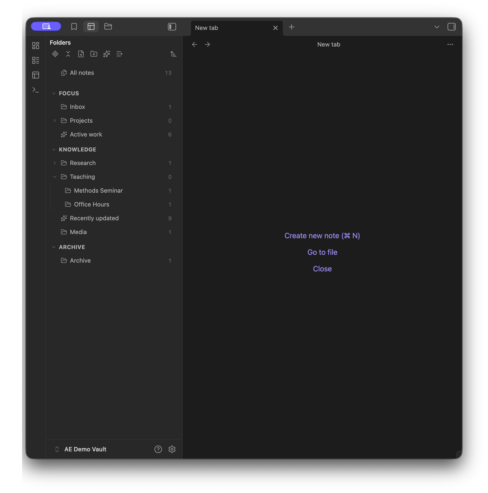
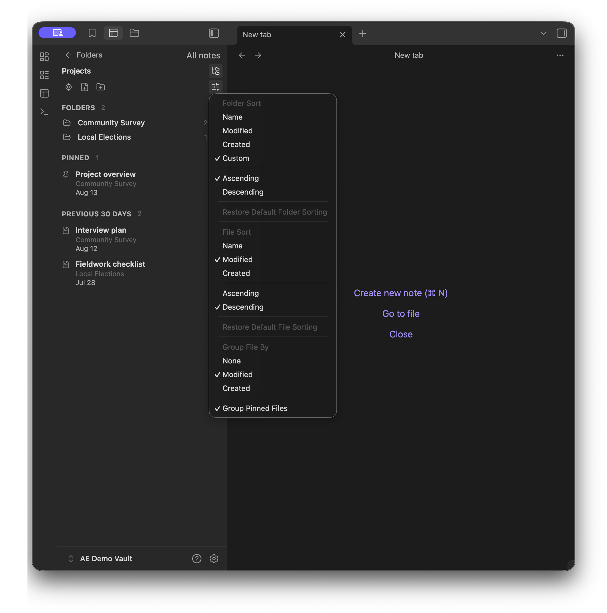

# Alternative Explorer

Alternative Explorer is an Apple Notes–style sidebar for browsing folders and notes in Obsidian. Switch between an expandable folder tree and a notes list — a compact alternative to the built-in File Explorer.

> **What’s new in 1.2.0.**
> 
> The sidebar is easier to scan and quicker to use. Folders show how many notes they hold, sort and grouping live in one **Display** menu, and clicking a note opens it and automatically shifts focus to the editor pane so you can type right away. [Full release notes](https://github.com/sunwookwak-polisci/Alternative-Explorer/releases/tag/1.2.0).

## Folders and Notes

- Browse the folder tree, open **All notes** for a vault-wide list, and use **Reveal current note** to jump to the active note's folder.
- Each folder shows its note count on the right.
- Expand or fold the whole tree, including its sections, in one action.
- Group root folders into named, collapsible sections.
- Drag the grip on a section, folder, or smart folder to change sidebar order. Click a folder to open its notes. Drop a folder onto another folder, or back to the vault root, to nest or un-nest it in the vault.
- Sort folders by name, modified time, created time, or a custom order. Set the default in **Settings → Alternative Explorer**, and override it for an individual folder from the explorer.

- Open a folder to see its notes.
- Switch **This folder** / **All below** to show only notes in that folder, or notes in that folder and its subfolders.
- Click the **Pinned** heading — or its chevron — to fold or expand that group. Display options stay on the sliders button in the notes toolbar.
- Click a note to open it and move typing into the editor.
- Create a **New note** or **New folder** from the sidebar.

## Smart folders

- Create saved searches from rules for tags, properties, name, path, created or modified dates, and pinned status.
- Match all or any of the rules, and nest a smart folder under a real folder or a section.

## Install and open

1. In Obsidian, open **Settings → Community plugins**.
2. Search for **Alternative Explorer**, select **Install**, and then select **Enable**.
3. Select the Alternative Explorer ribbon icon or run **Alternative Explorer: Open explorer view** from the command palette.

## Some Details

- Sections, smart folders, sidebar order, and sort overrides are stored in plugin settings. They do not edit vault content.
- Dropping a folder onto another folder, or a nested folder back to the vault root or a section, moves that folder in the vault. ***(They DO edit vault content.)***
- On a phone or tablet, a custom folder order still applies, but you cannot rearrange it. Drag-to-reorder is desktop-only for now. A future version will allow mobile rearrangement.
- Pin notes through Obsidian's core Bookmarks plugin. If Bookmarks is disabled, pinned groups are empty and pinning is unavailable.
- Vault files that Obsidian cannot open appear in the notes list. A second click or **Enter** opens them in the system default application when available.
- Alternative Explorer does not search note contents, and it does not rename or delete existing notes.
- Alternative Explorer has been tested only on macOS, iOS, and iPadOS. Other platforms may work but have not been verified.
- The minimum supported Obsidian version is 1.7.2.

## Acknowledgements

Alternative Explorer was inspired by Apple Notes and [Notebook Navigator](https://notebooknavigator.com) ([GitHub](https://github.com/johansan/notebook-navigator)).

## License

Alternative Explorer is released under the [MIT License](LICENSE).
